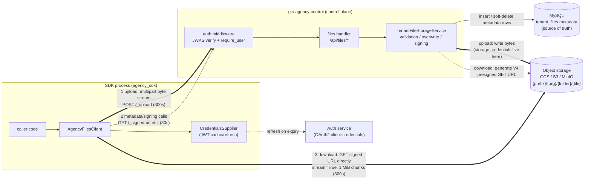
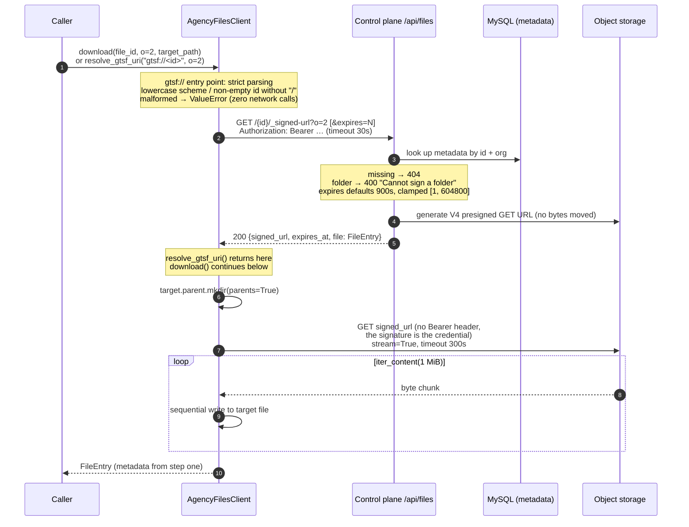

# File Storage Flows: Upload / Download Architecture

Covers the `AgencyFilesClient` implementation
(`agency_sdk/delegates/files_client.py`) for
[issue #1](https://github.com/groundtruthsystems/gts-agency_python-sdk/issues/1).
Server-side counterpart: `gts-agency-control/src/handler/files.rs` and
`service/tenant_files/`.

Core design (asymmetric):

- **Upload**: bytes pass **through** the control plane (relay style) — validation,
  overwrite semantics, and metadata persistence happen on the byte path.
- **Download**: bytes **bypass** the control plane (presigned direct-to-storage) —
  the control plane only issues a short-lived signed URL; object storage carries
  the bandwidth.

## Component Architecture



> Thick edges are **byte paths**; thin edges are **metadata/control paths**.
> Storage credentials exist only on the control plane; the SDK only ever holds a
> time-limited signed URL for downloads (default 15 minutes).

## Upload Flow (relay style)

`client.upload(organisation_id, file_paths, path)` — byte path:
local disk → SDK process memory → HTTP request body → control plane memory →
object storage.

```mermaid
sequenceDiagram
    autonumber
    participant APP as Caller
    participant SDK as AgencyFilesClient.upload()
    participant IDP as Auth service
    participant CP as Control plane /api/files/_upload
    participant DB as MySQL (metadata)
    participant OS as Object storage

    APP->>SDK: upload(o=2, [a.pdf, b.txt], path="guidelines")
    Note over SDK: empty file_paths → ValueError immediately<br/>(no network call)
    SDK->>IDP: only when cached JWT expired:<br/>client-credentials exchange
    IDP-->>SDK: access_token
    Note over SDK: ExitStack opens handles<br/>mimetypes guesses content type by extension<br/>builds multipart: repeated "file" fields
    SDK->>CP: POST /_upload?o=2&path=guidelines<br/>Authorization: Bearer …<br/>Content-Type: multipart/form-data; boundary=…<br/>(timeout 300s)
    Note over CP: axum DefaultBodyLimit: body ≤ 100 MiB (else 413)<br/>JWKS signature + audience + require_user
    loop each multipart field
        Note over CP: field name ≠ "file" → silently ignored<br/>missing filename or contains / \ .. → 400<br/>chunked read, per-file total ≤ 100 MiB → else 400
        CP->>DB: active row with same name in folder?<br/>→ soft-delete old row (overwrite semantics)
        CP->>OS: save_object_from_bytes<br/>key: {prefix}/{org}/{folder}/{filename}
        CP->>DB: insert new metadata row<br/>(id, size_bytes, content_type, uploaded_by…)
    end
    CP-->>SDK: 200 {"uploaded": [FileEntry…]}
    SDK-->>APP: UploadResult (Pydantic)
```

## Download Flow (presigned direct, two steps)

`client.download(file_id, organisation_id, target_path)` — byte path:
object storage → SDK process (1 MiB chunks) → local disk; **never through the
control plane**.



## Constraint Quick Reference

| Constraint | Value | Enforced by |
|---|---|---|
| Per-file upload cap | 100 MiB | server service, cumulative count (400) |
| Whole request body cap | 100 MiB (shared by multiple files) | server axum route layer (413) |
| Multipart field name | must be `file`; other names **silently ignored** | server |
| File/folder names | non-empty; no `/`, `\`, `..` | server (400) |
| Same-name upload | overwrite: old row soft-deleted, object key reused | server |
| Signed URL lifetime | default 900s, clamped [1, 604800] | server |
| Upload/download timeout | 300s (metadata/signing calls 30s) | SDK |
| Download memory peak | ≈1 MiB (streamed chunks) | SDK |
| Upload memory peak | ≈ total file size (requests builds multipart body) | SDK, bounded by the 100 MiB cap |
| `gtsf://` parsing | SDK-side convention only; malformed → `ValueError` | SDK (before any request) |

## Why the Asymmetry

Download is read-only: metadata lookup and byte retrieval separate safely, so a
presigned URL offloads bandwidth to object storage and expires on its own. Upload
is a transaction — validate + soft-delete the overwritten row + write the object +
persist metadata — and passing bytes through the control plane is the simplest way
to keep that consistent; the 100 MiB cap keeps the relay cost acceptable. If larger
files are ever needed, the evolution path is a "presigned upload session + completion
confirmation" endpoint pair (cf. Slack `completeUploadExternal` / Git LFS `verify`),
leaving the current API untouched.
